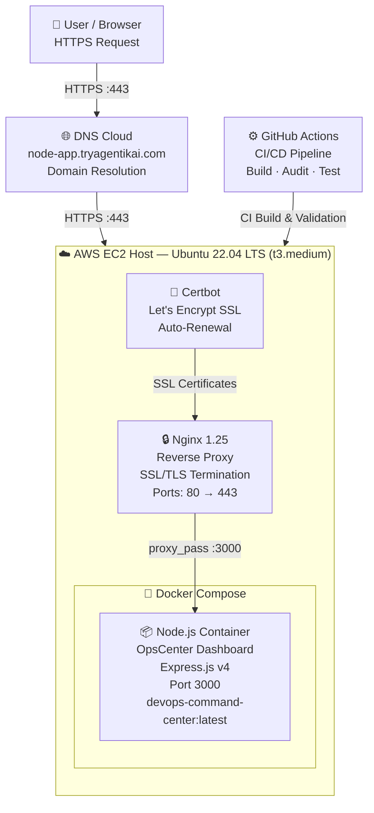
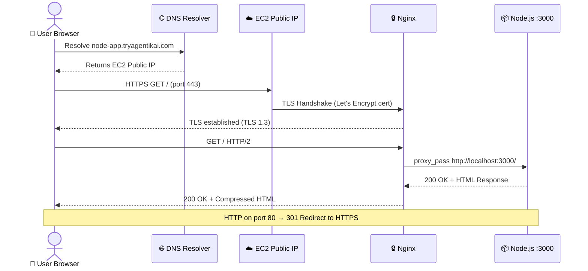
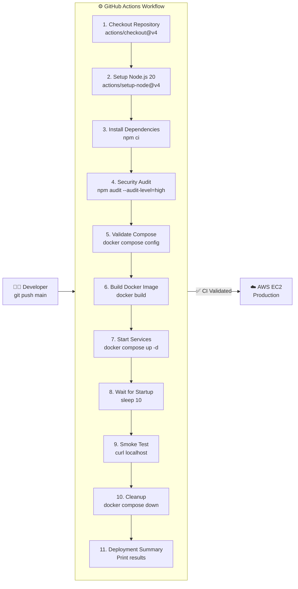
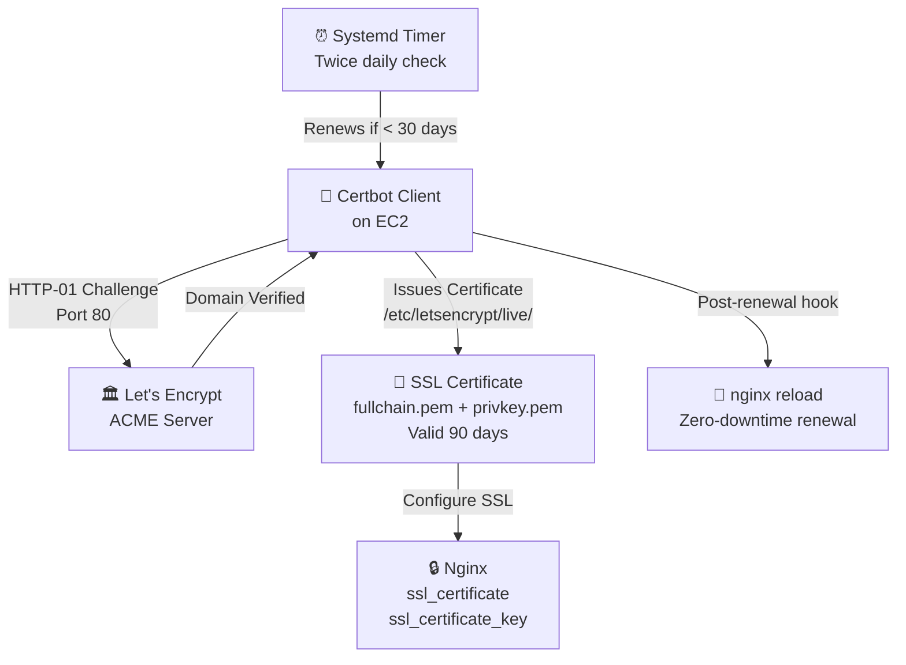
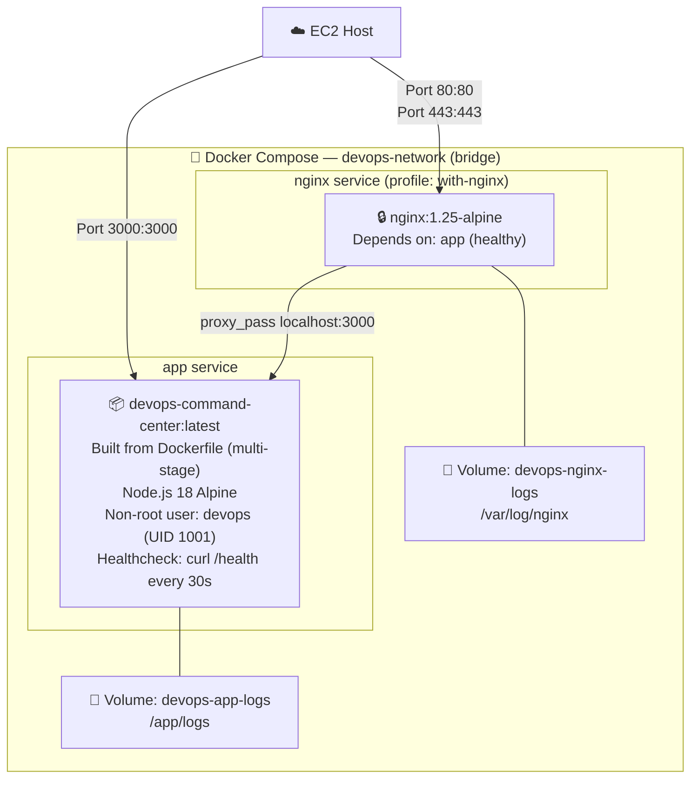
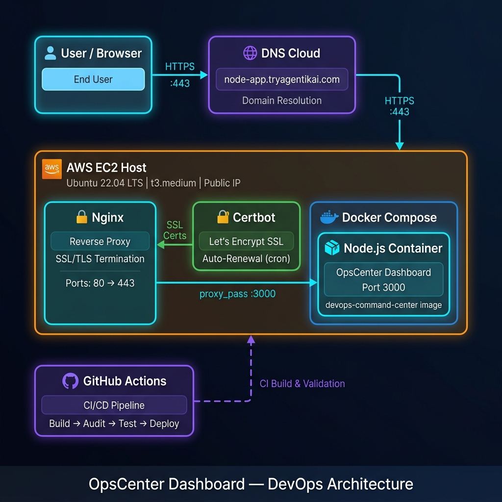

# 🏗️ System Architecture — OpsCenter Dashboard

> Architecture documentation for the Node.js OpsCenter Dashboard deployed on AWS EC2 with Docker, Nginx, Certbot SSL, and GitHub Actions CI/CD.

---

## Overview

The OpsCenter Dashboard follows a modern cloud-native architecture with the following key layers:

1. **Client Layer** — End user accesses via HTTPS through a web browser
2. **DNS Resolution** — Domain `node-app.tryagentikai.com` resolves to EC2 Public IP
3. **AWS EC2 Host** — Ubuntu 22.04 LTS instance running all services
4. **Nginx** — Reverse proxy handling SSL termination and traffic routing
5. **Docker Compose** — Container orchestration for the Node.js application
6. **Node.js Container** — Express.js application serving the dashboard
7. **GitHub Actions** — CI/CD pipeline for automated build and validation

---

## High-Level Architecture Diagram

---

## Detailed Request Flow

---

## CI/CD Pipeline Flow

---

## SSL/TLS Certificate Lifecycle

---

## Docker Compose Service Architecture

---

## Infrastructure Component Summary

| Component | Technology | Version | Role |
|-----------|-----------|---------|------|
| Cloud Host | AWS EC2 | Ubuntu 22.04 LTS | Server infrastructure |
| Runtime | Node.js | 20 LTS | Application runtime |
| Framework | Express.js | 4.x | Web framework |
| Container | Docker | 24.x | Application containerization |
| Orchestration | Docker Compose | v2.x | Multi-container management |
| Reverse Proxy | Nginx | 1.25 Alpine | SSL termination + routing |
| SSL/TLS | Let's Encrypt | Certbot 2.x | Free SSL certificate authority |
| CI/CD | GitHub Actions | - | Automated build & validation |
| Domain | DNS A Record | - | node-app.tryagentikai.com |

---

## Network Port Map

| Port | Protocol | From | To | Purpose |
|------|----------|------|----|---------|
| 22 | TCP | Admin IP | EC2 | SSH management |
| 80 | TCP | Internet | Nginx | HTTP + Certbot ACME challenge |
| 443 | TCP | Internet | Nginx | HTTPS (TLS 1.2/1.3) |
| 3000 | TCP | Nginx (localhost) | Node.js container | App traffic (internal) |

---

## Architecture Diagram (Image)

---

*Generated: June 2025 | OpsCenter Dashboard v1.0.0*
